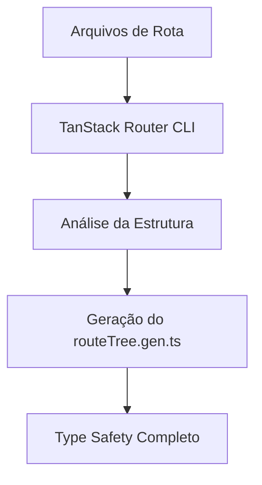

# 🗺️ TanStack Router - Route Tree Gen
## Roteiro para Apresentação Frontend Chapter

---

## 📋 Agenda da Apresentação

1. **O que é o Route Tree Gen?**
2. **Por que foi criado?**
3. **Como funciona na prática**
4. **Estrutura do arquivo gerado**
5. **Benefícios e Type Safety**
6. **Demonstração prática**
7. **Comparação com outros roteadores**

---

## 1️⃣ O que é o Route Tree Gen?

### Conceito Principal
- **Arquivo gerado automaticamente** pelo TanStack Router
- **Mapa completo** de todas as rotas da aplicação
- **Type Safety** garantido em tempo de compilação
- **Single source of truth** para navegação

### Localização no Projeto
```
src/
  routeTree.gen.ts ← Este é nosso protagonista!
  routes/
    __root.tsx
    _auth.tsx
    _product.tsx
    index.tsx
    login.tsx
    ...
```

---

## 2️⃣ Por que foi criado?

### Problemas dos Roteadores Tradicionais

#### React Router (Exemplo)
```tsx
// ❌ Sem type safety
<Link to="/produto/123/detalhes" /> // Pode quebrar silenciosamente
navigate('/usuarios/' + userId)     // Sem validação de tipos
```

#### Problemas Comuns:
- 🚨 **URLs quebradas** em produção
- 🔍 **Difícil refatoração** de rotas
- 📝 **Sem autocomplete** para navegação
- 🐛 **Erros em runtime** não detectados

### A Solução TanStack Router
```tsx
// ✅ Com type safety completo
<Link to="/product/$category/$productId" 
      params={{ category: 'electronics', productId: '123' }} />
      
navigate({ to: '/user/$userId', params: { userId } }) // Validado!
```

---

## 3️⃣ Como funciona na prática?

### Fluxo de Geração



### Estrutura de Pastas → Rotas

```
routes/
  __root.tsx                    → Base da aplicação
  index.tsx                     → "/"
  login.tsx                     → "/login"
  _auth.tsx                     → Layout para rotas autenticadas
  _auth.cart.tsx                → "/cart"
  _auth.profile.tsx             → "/profile"
  _product.tsx                  → Layout para produtos
  _product.$category.tsx        → "/:category"
  _product.$category.$productId.tsx → "/:category/:productId"
```

---

## 4️⃣ Estrutura do Arquivo Gerado

### Seção 1: Imports Automáticos
```typescript
// Todos os imports são gerados automaticamente
import { Route as rootRouteImport } from './routes/__root'
import { Route as LoginRouteImport } from './routes/login'
import { Route as ProductRouteImport } from './routes/_product'
// ... mais imports
```

### Seção 2: Configuração das Rotas
```typescript
const LoginRoute = LoginRouteImport.update({
  id: '/login',
  path: '/login',
  getParentRoute: () => rootRouteImport,
} as any)

const ProductCategoryRoute = ProductCategoryRouteImport.update({
  id: '/$category',
  path: '/$category', 
  getParentRoute: () => ProductRoute, // Hierarquia!
} as any)
```

### Seção 3: Interfaces TypeScript
```typescript
export interface FileRoutesByFullPath {
  '/': typeof IndexRoute
  '/login': typeof LoginRoute
  '/cart': typeof AuthCartRoute
  '/$category': typeof ProductCategoryRouteWithChildren
  '/$category/$productId': typeof ProductCategoryProductIdRoute
}
```

### Seção 4: Árvore Final
```typescript
export const routeTree = rootRouteImport
  ._addFileChildren(rootRouteChildren)
  ._addFileTypes<FileRouteTypes>()
```

---

## 5️⃣ Benefícios e Type Safety

### Type Safety Completo

```tsx
// ✅ Parâmetros validados
navigate({ 
  to: '/product/$category/$productId',
  params: { 
    category: 'electronics', // ← Obrigatório
    productId: '123'         // ← Obrigatório
  }
})

// ❌ TypeScript erro se esquecer parâmetros
navigate({ to: '/product/$category/$productId' }) // Error!
```

### Autocomplete Inteligente
```tsx
// O VS Code sugere todas as rotas disponíveis
<Link to="/prof..." // → "/profile" aparece no autocomplete
```

### Refatoração Segura
```typescript
// Renomear uma rota atualiza TODOS os usos
// Nenhum link quebrado passa despercebido
```

---

## 6️⃣ Demonstração Prática

### Exemplo Real do Nosso E-commerce

#### Estrutura de Rotas
```
🏠 / (home)
🔐 /login
🛒 /cart (protegida)
👤 /profile (protegida)  
📱 /electronics (categoria)
📱 /electronics/iphone-15 (produto específico)
```

#### Como o Router Entende
```typescript
// Layout de autenticação (_auth.tsx)
beforeLoad: async ({ context }) => {
  if (!context.user) throw redirect({ to: "/unauthenticated" });
}

// Produto específico (_product.$category.$productId.tsx)
loader: async ({ params }) => {
  const product = await productsService.getProductById(
    params.productId, // ← Type safe!
    params.category   // ← Type safe!
  )
  return { product }
}
```

---

## 7️⃣ Comparação com Outros Roteadores

### React Router v6
```tsx
// ❌ Sem type safety
<Routes>
  <Route path="/product/:category/:id" element={<Product />} />
</Routes>

// Navegação perigosa
navigate(`/product/${category}/${id}`) // Pode quebrar
```

### Next.js App Router
```tsx
// ❌ Baseado em arquivos, mas sem validação de parâmetros
// pages/product/[category]/[id].tsx

// Navegação
router.push(`/product/${category}/${id}`) // Sem validação
```

### TanStack Router
```tsx
// ✅ Type safety + File-based + Validação
const Route = createFileRoute('/_product/$category/$productId')({
  loader: ({ params }) => {
    // params é totalmente tipado!
  }
})

// Navegação 100% segura
navigate({ 
  to: '/product/$category/$productId',
  params: { category, productId } // Validado!
})
```

---

## 🎯 Pontos-chave para destacar

### 1. **Zero Runtime Errors**
- Todos os erros de rota são capturados em **build time**
- Impossível navegar para uma rota inexistente

### 2. **Developer Experience Superior**
- **Autocomplete** para todas as rotas
- **Refatoração segura** 
- **Documentação viva** no código

### 3. **Performance**
- Árvore de rotas otimizada
- **Code splitting** automático
- **Lazy loading** inteligente

### 4. **Manutenibilidade**
- Uma mudança na estrutura de pastas atualiza tudo
- Nenhum link "órfão" passa despercebido
- **Single source of truth**

---

## 🚀 Demonstração ao Vivo

### O que mostrar:

1. **Navegar pelo routeTree.gen.ts**
   - Mostrar a estrutura hierárquica
   - Explicar as interfaces geradas

2. **Criar uma nova rota**
   - Adicionar arquivo em `routes/`
   - Mostrar regeneração automática

3. **Usar type safety na navegação**
   - Mostrar autocomplete
   - Provocar erro proposital

4. **Refatorar uma rota**
   - Renomear arquivo
   - Mostrar como TypeScript detecta problemas

---

## 💡 Dicas para a Apresentação

### Para Desenvolvedores React:
- **Enfatize** a diferença de DX (Developer Experience)
- **Compare** diretamente com React Router
- **Mostre** erros em tempo real

### Para Tech Leads:
- **Destaque** redução de bugs em produção
- **Mencione** facilidade de refatoração
- **Fale** sobre onboarding de novos desenvolvedores

### Para o Time:
- **Demonstre** na prática com o projeto atual
- **Deixe** eles experimentarem
- **Colete** feedback em tempo real

---

## ❓ Perguntas Esperadas

**P: "Não adiciona complexidade desnecessária?"**
**R:** O arquivo é gerado automaticamente. Zero overhead para o developer.

**P: "E se eu quiser customizar alguma rota?"**  
**R:** Você nunca edita o `.gen.ts`. Customizações vão nos arquivos individuais.

**P: "Performance é boa?"**
**R:** Melhor que React Router. Code splitting e lazy loading automáticos.

**P: "Migration de React Router é difícil?"**
**R:** TanStack Router tem guias específicos e pode coexistir inicialmente.

---

## 🎬 Fechamento

### Resumo dos Benefícios:
- ✅ **Type Safety** completo
- ✅ **Zero runtime errors** de navegação  
- ✅ **Developer Experience** superior
- ✅ **Manutenibilidade** a longo prazo
- ✅ **Performance** otimizada

### Call to Action:
"Vamos experimentar em um projeto piloto e medir os resultados?"

---

*Este roteiro foi criado baseado no projeto real TanStack Market - um e-commerce completo com autenticação, produtos e carrinho de compras.*
